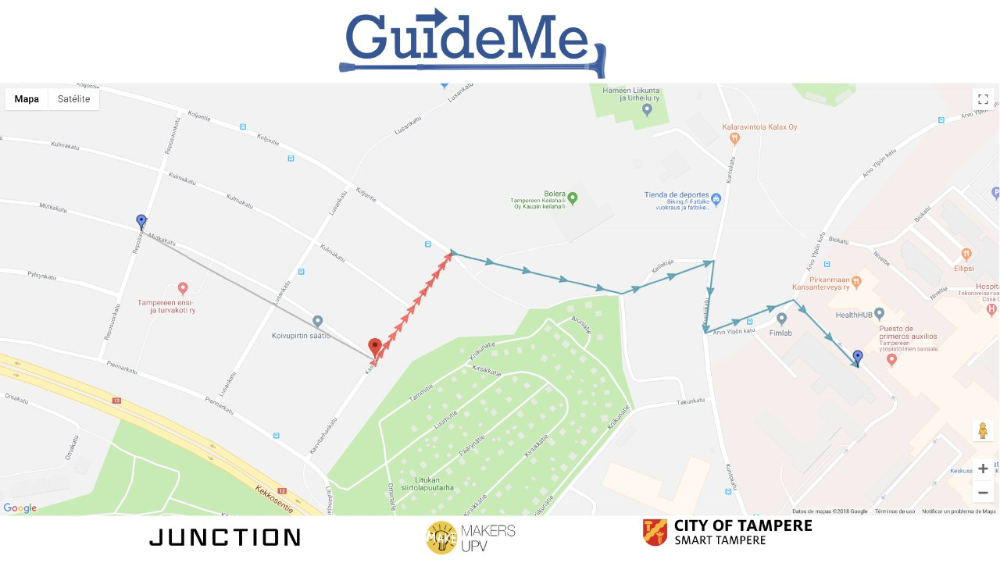
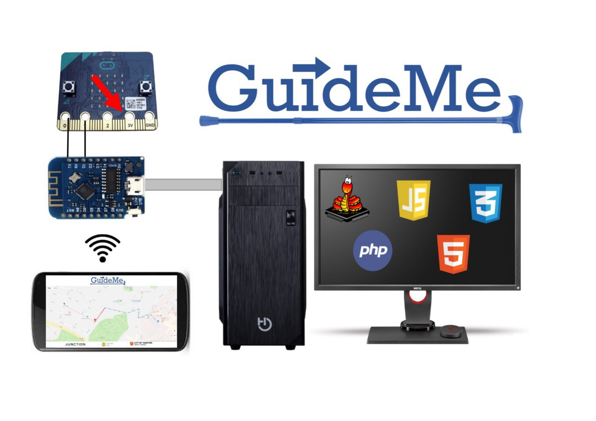
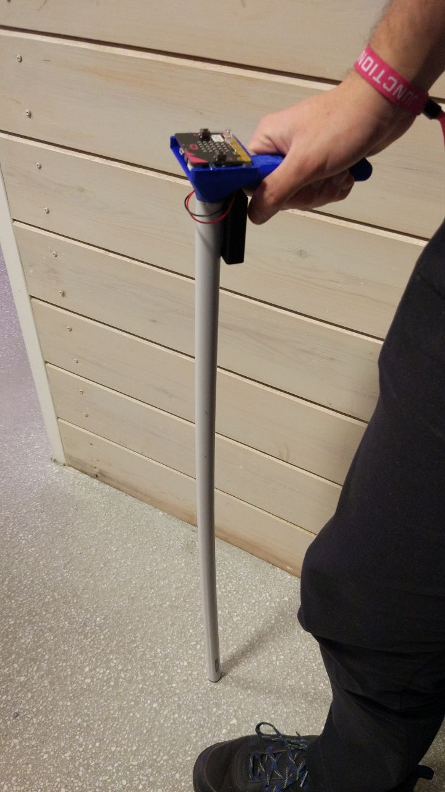

# GuideMe 
## The ultimate solution for improving elderly or disabled pedestrian mobility in a connected city

# General idea:
GuideMe  pretends to bring closer adavtanges of the modern world to people who are not fully adapted to new techonologies.

# Our product:
We have developed an integral solution for the outdoor guidance of elderly or disabled people, offering a fully functional walking stick which provides clear and concise indications for guidance between points in the city, improving their quality of life.

# Future capabilities:
This GuideMe has room for improvement in many ways. It would be possible to link a public transport ticket to commute in the city or optimize the route to avoid slopes or rough sidewalks.

Also, it would be possible to track the location of the stick in real time to make interventions easier in case of emergency (or even include an emergency button to call the emergency services if required).

Using the live data of the Tampere city its realistic to send live information of the traffic lights, making sure that the user realises about the actual state of the traffic lights.

The system could be implemented as well in public buildings such as hospitals, train stations... having an indoor beacon-based guidance system.

Some extra features could be inductive charge and LED flashlight to improve visibility in dark areas.

# Development of the proof of concept prototype
We have develope a proof of concept prototype in order to test and demostrate the technology. The proof of concept walking stick mainly consist on an smart handle with some electronics as a LED matrix with a digital compass (MicroBit) and a WiFi node to transmit all the information between the GuideMe smart stick and the web app server and GUI.

The handle electronics consist on a MicroBit board with a 5x5 LED matrix and a digital compass connected to a ESP8266 WiFi microcontroller acting as a IoT node for transmiting the information from and to the server. All that hardware is integrated on a 3D printed handle as an enclosure with the stick.

MicroBit board is programmed using [MicroPython](https://microbit-micropython.readthedocs.io/en/latest/), a lean and efficient implementation of the Python 3 programming language optimised to run on microcontrollers.

Wemos ESP8266 is programmed using [Arduino IDE](https://www.arduino.cc/), an Open-source electronic prototyping platform enabling users to create interactive electronic objects.

We have also developed a graphical user interface for demo purpose that shows on real time the location of the elderly person holding the stick. That could be used by adults to know the location of their relatives.

The web application is updated on every movement the elder person does and is able to optimize the best way to reach the objective location.

For the web app the backend API is enterely develope using PHP and combined with HTML, CSS, JS,JQuery and AJAX for the frontend.
